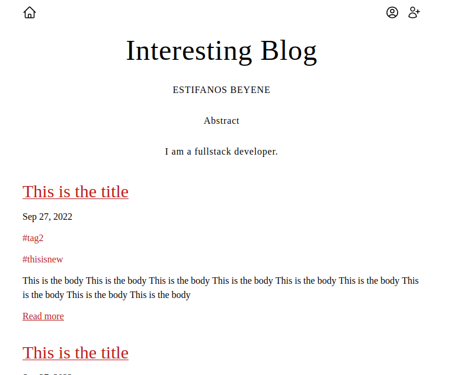

# Project: Blog API

- Live link: <https://project-blog-api-client-production.up.railway.app/>
- Server repo: <https://github.com/justEstif/project-blog-api-server>

## Purpose

- Creating the client side of a blog website.
- Project description: <https://www.theodinproject.com/lessons/nodejs-blog-api>

## Using

- React
- Tailwind
- Vite

## Design:

- [Inspiration](https://themes.gohugo.io/themes/hugo-ficurinia/)
